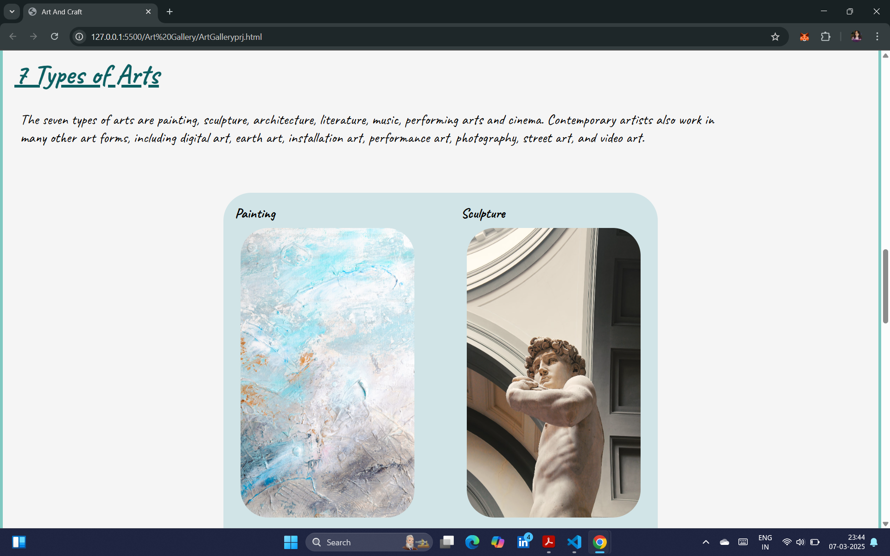
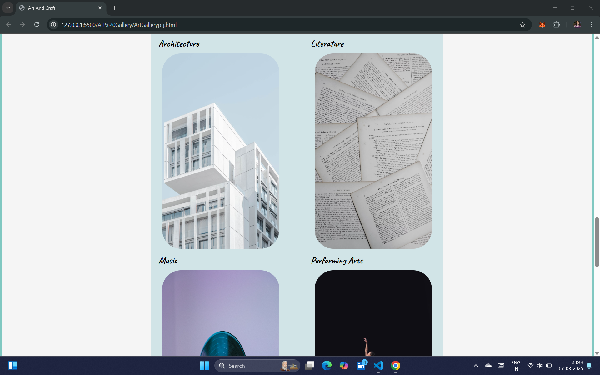
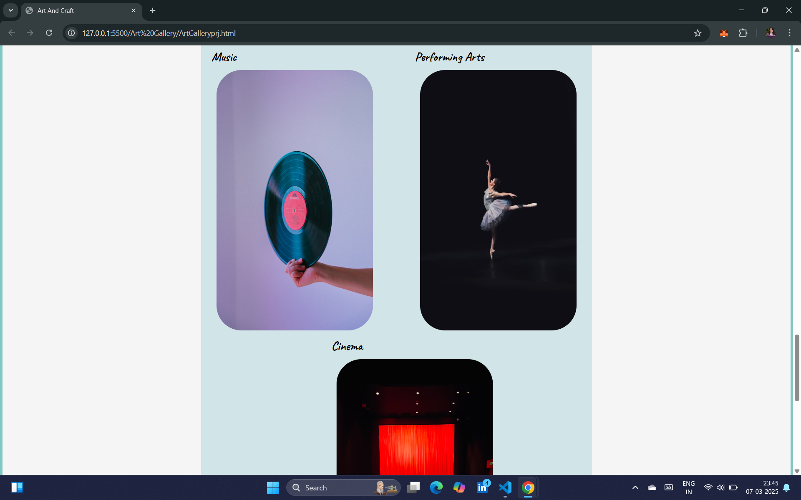
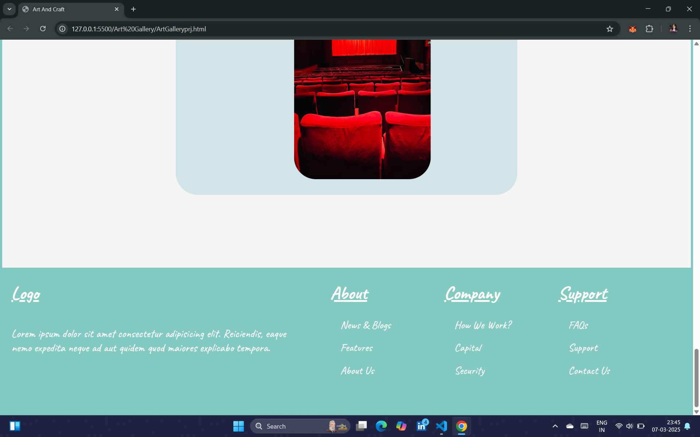

# Art Gallery Web Project 🎨

## Introduction

The **Art Gallery Web Project** is a simple and elegant web page showcasing various forms of art, including painting, sculpture, architecture, literature, music, performing arts, and cinema. The project is designed with a minimalist yet aesthetic layout using **HTML & CSS**.

## Features

✅ Responsive design for seamless viewing on different devices  
✅ Well-structured navigation with a clean UI  
✅ Image gallery displaying different art forms  
✅ Informative sections explaining various types of arts  
✅ A well-designed footer for additional navigation

## Technologies Used

- **HTML5** for structuring the webpage
- **CSS3** for styling and layout
- **Google Fonts** for improved typography
- **Flexbox & Grid** for responsive design

## How to Use

1. Clone this repository:

   ```bash
   git clone https://github.com/sanie99/ArtGalleryWebProject.git

   ```

2. Open ArtGalleryprj.html in your browser.
3. Enjoy exploring the world of art!

## Preview






## Future Enhancements

🔹 Add a light/dark mode toggle
🔹 Implement animations for smoother transitions
🔹 Integrate JavaScript for an interactive user experience

## Contributing

Feel free to fork this repository and submit pull requests. Contributions are always welcome!

## License

This project is open-source and available under the MIT License.
