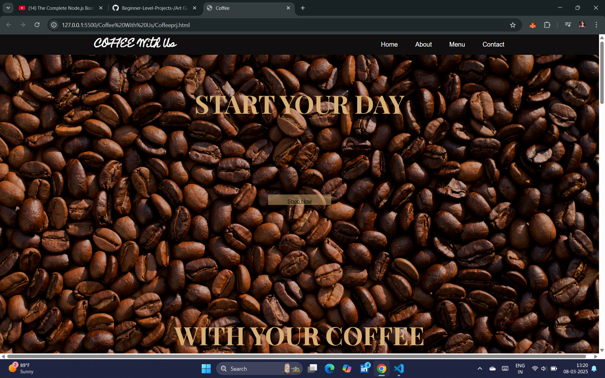

# Coffee Shop Web Project ☕

## Introduction

The **Coffee Shop Web Project** is a beautifully designed, responsive webpage that showcases a café experience. It features a welcoming homepage, an about section, and a product menu, all crafted with **HTML & CSS** for an elegant and seamless browsing experience.

## Features

✅ Stunning hero section with a background image and call-to-action  
✅ Informative "Our Story" section about the café  
✅ A dedicated "Perfect Place" section to highlight ambiance  
✅ A featured menu with popular coffee options  
✅ Responsive design for mobile and desktop

## Technologies Used

- **HTML5** for structuring the webpage
- **CSS3** for styling, animations, and responsiveness
- **Google Fonts** for elegant typography
- **Flexbox & Grid** for layout design

## How to Use

1. Clone this repository:
   ```bash
   git clone https://github.com/sanie99/CoffeeShopWebProject.git
   ```
2. Open Coffeeprj.html in your browser.
3. Enjoy the café experience from your screen!

## Preview



## Future Enhancements

🔹 Add a fully functional shopping cart
🔹 Implement JavaScript for interactive user engagement
🔹 Integrate backend support for online orders

## Contributing

If you’d like to contribute, feel free to fork this repository and submit pull requests.

## License

This project is open-source and available under the MIT License.
