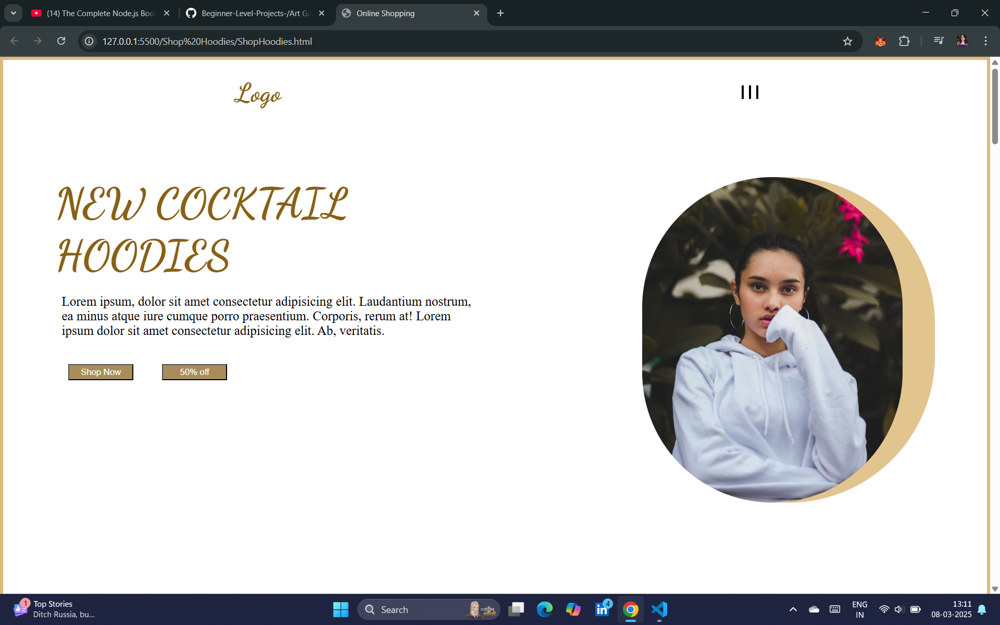
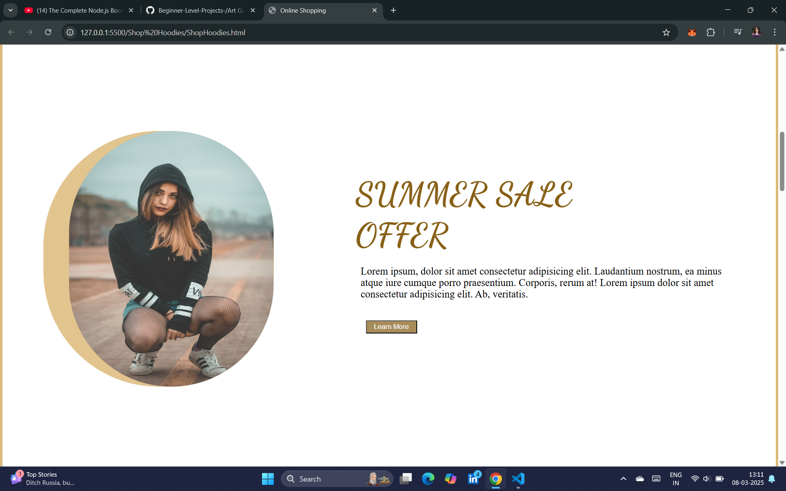
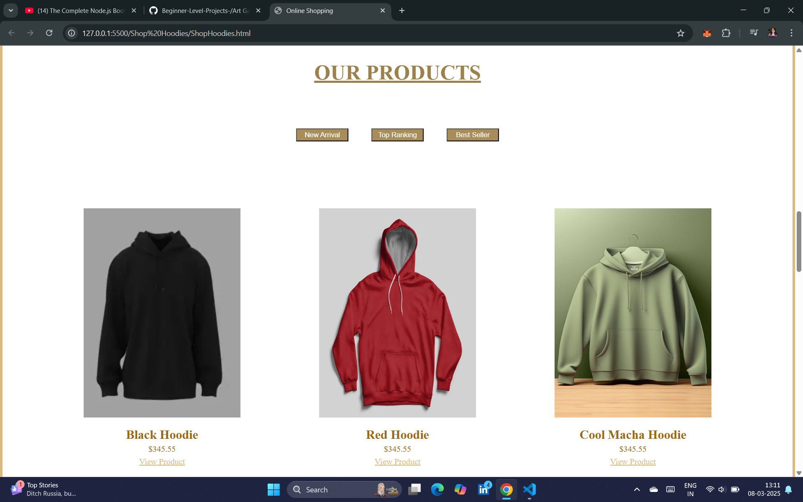
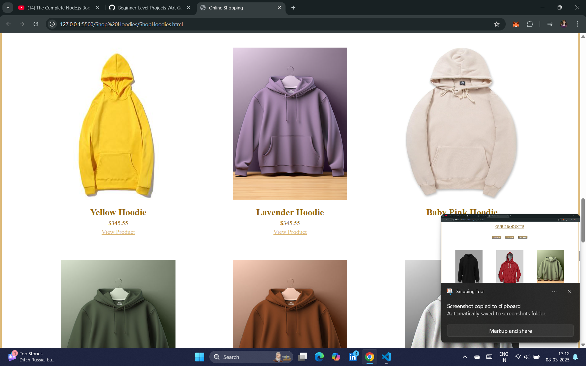
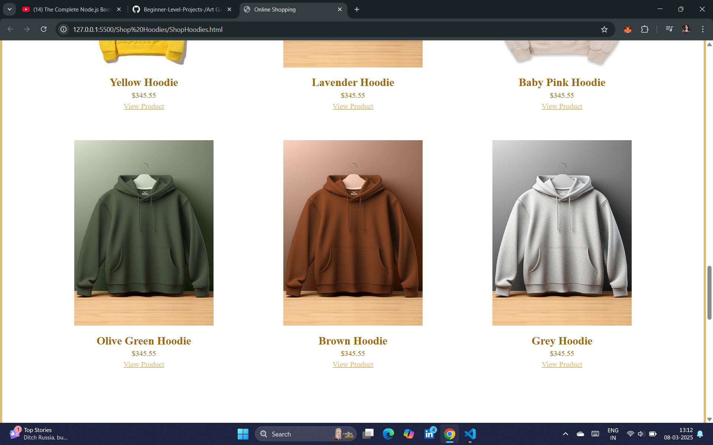
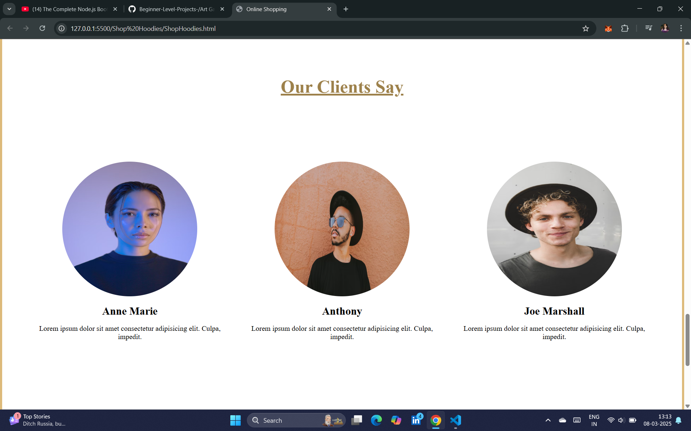
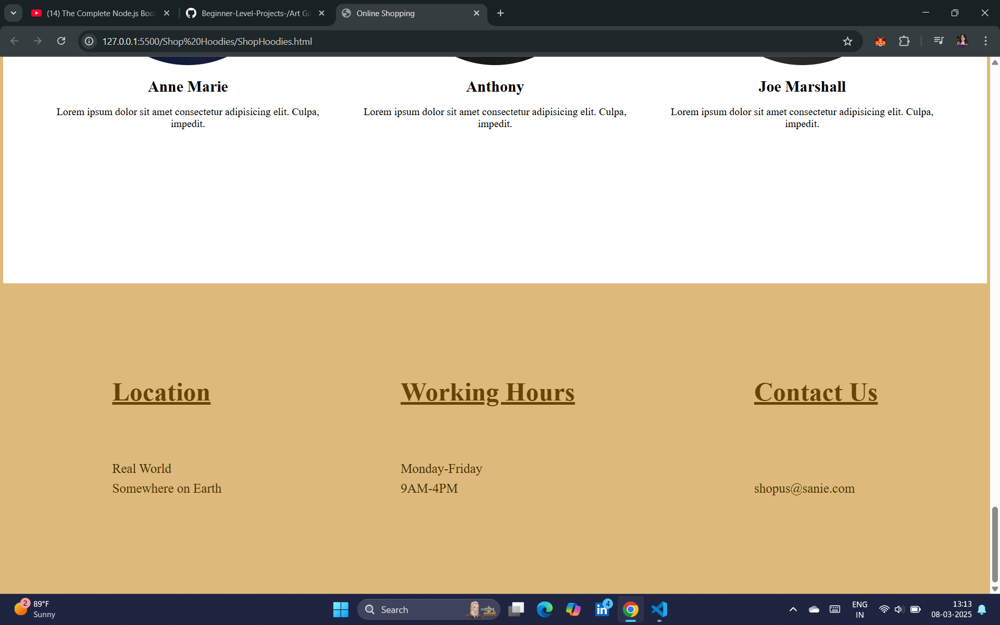

# Online Hoodie Shop Web Project 🛍️

## Introduction

The **Online Hoodie Shop Web Project** is a stylish and responsive e-commerce webpage for hoodie lovers. Designed with a modern UI, it features a product showcase, promotional sections, and customer testimonials, making online shopping an engaging experience.

## Features

✅ Eye-catching hero section with discount offers  
✅ Summer sale promotional banner  
✅ Detailed product showcase with images and prices  
✅ Customer reviews section for credibility  
✅ Fully responsive design for mobile and desktop

## Technologies Used

- **HTML5** for page structure
- **CSS3** for styling and animations
- **Google Fonts** for elegant typography
- **Flexbox & Grid** for responsive layout

## How to Use

1. Clone this repository:
   ```bash
   git clone https://github.com/sanie99/OnlineHoodieShop.git
   ```
2. Open ShopHoodies.html in your browser.
3. Browse, shop, and explore!

## Preview









## Future Enhancements

🔹 Add a shopping cart with JavaScript
🔹 Implement backend support for order processing
🔹 Integrate payment gateway for online purchases

## Contributing

Contributions are welcome! Feel free to fork the repository and submit pull requests.

## License

This project is open-source and available under the MIT License.
